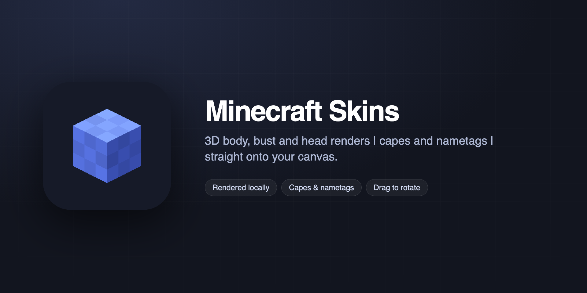

# Minecraft Skins for Figma

A Figma plugin that puts Minecraft skin renders on your canvas. Type a username
or drag in a skin file, pick a view, hit import.

## Installing

The plugin is on the Figma Community. To run it from source instead:

1. Clone this repo.
2. In Figma, open **Plugins → Development → Import plugin from manifest…**
3. Pick `manifest.json`.

There is no build step and no dependencies. Three files do the work: the
manifest, `code.js` for the plugin sandbox, and `ui.html` for the panel.

## Using it

Type a username in the first tab, or drop a 64×64 PNG in the second one (old
64×32 skins work too). Leave the field empty and you get Steve.

| View | What you get |
| --- | --- |
| 3D body | the whole character, NameMC style |
| 3D bust | head, torso and arms |
| 3D head | just the head, isometric |
| 2D face | the 8×8 front of the head, pixel for pixel |
| 2D body | a flat front view built from the texture |
| Texture | the raw skin file, scaled up |

Drag on the preview to spin the model: sideways for rotation, up and down for
tilt. The sliders do the same if you want an exact angle. Since everything is
drawn locally the preview keeps up with the mouse.

Capes come from three places: the player's Mojang cape, their OptiFine cape, or
one of the five MineCon convention capes. When a cape can't be fetched the skin
still renders and the reason appears under the dropdown.

The nametag option adds a text layer above the image. The two go into a single
frame so you can move them together, but they stay separate layers, so the text
remains editable and you choose the typeface yourself once it's in Figma.

The panel is in English and switches to French when that's the system language.
There's a manual override at the bottom, because Figma doesn't tell plugins
which language its own interface is in.

Your last ten imports are kept, with thumbnails. Clicking one restores the whole
setup. File-based imports keep their texture, so they replay without dropping
the PNG again.

## How the renderer works

Everything is drawn in a canvas inside the plugin. No render service is
involved, which is what makes dragging feel immediate.

The model is six boxes (head, torso, two arms, two legs) plus the outer layer,
inflated by half a pixel on the head and a quarter elsewhere, and a cape box
hanging off the shoulders at 11°. One unit is one skin pixel and the character
is 32 units tall. Face UVs follow Minecraft's own box unwrap, so a single
function handles every box, cape included.

The projection is orthographic. That matters: under rotation a box face stays a
parallelogram, which is exactly what `ctx.setTransform()` can draw, so each face
is one `drawImage` call and no quad ever needs splitting. Back faces are culled
by their normal, the rest are sorted by depth and painted back to front. Shading
is fixed per face direction the way the game does it, applied through
pre-darkened copies of the texture rather than a black overlay, which keeps
transparent pixels transparent.

Output dimensions are computed once by sweeping every angle the user can reach
and keeping the largest extent. The render never changes size mid-drag, and the
frame is tighter than an analytic bound would give.

Three caches keep the per-frame work down: darkened textures (one set per skin
and per cape), geometry and framing (one per body shape / parts / layer / cape
combination), and a single reused output canvas. Once warm, forty consecutive
frames allocate no canvas at all. Drag renders are coalesced on
`requestAnimationFrame`, since `pointermove` fires faster than the screen
refreshes.

Measured in software rendering, with the canvas command queue flushed each
frame: 0.25 ms per frame at 256 px, 0.54 ms at 512, 1.57 ms at 1024.

A few texture quirks are handled along the way. The slim model is detected from
the transparency of pixels (50,16), (54,20), (42,48) and (46,52). Legacy 64×32
skins get their left limbs mirrored from the right ones. Many of those old skins
have no alpha channel at all, so their hat layer is an opaque block that would
hide the face; it's dropped when the always-unused (0,0) corner is opaque *and*
the hat holds no transparent pixel. 64×64 skins are left alone, because some
store data in unused areas while still having a real hat layer.

## Network

The only thing that leaves the plugin is the username you type. Nothing is sent
anywhere else, and rendering never touches the network.

| Needed for | Source |
| --- | --- |
| Default Steve skin, MineCon capes | `textures.minecraft.net` (Mojang's own CDN) |
| Player skin textures | `mc-heads.net`, falling back to `minotar.net` |
| Mojang and OptiFine player capes | `capes.dev` |

Responses are cached for the session, so changing the angle, the view or the
size never fires another request. Replies are checked by their header bytes
first, because some of these services answer with an error page under a 200
status and `figma.createImage()` only takes PNG or JPEG.

These are free community services with no uptime guarantee. `capes.dev` in
particular was returning 500s during development. Nothing breaks when one is
down: the skin renders and the failure is reported in the panel.

## A note on assets

The plugin ships no Minecraft files. The default Steve skin and the MineCon cape
textures are fetched from Mojang's own CDN at runtime rather than bundled, which
keeps this a link to the official source instead of a redistribution.

Anything built around the game falls under the [Minecraft Usage Guidelines][mug].
Two points apply here. Mojang names aren't supposed to be the first word or the
dominant part of a product title, which a name starting with "Minecraft" doesn't
satisfy. And the disclaimer below has to appear on the product and its listing;
it sits at the bottom of the panel.

> NOT AN OFFICIAL MINECRAFT PRODUCT. NOT APPROVED BY OR ASSOCIATED WITH MOJANG
> OR MICROSOFT.

[mug]: https://www.minecraft.net/en-us/usage-guidelines

## Credits

Skin lookups by [MC-Heads](https://mc-heads.net) and
[Minotar](https://minotar.net), cape lookups by [capes.dev](https://capes.dev).
All three are free to use and asked for nothing in return, so the plugin keeps a
credit line visible.

`icon.png` and `cover.png` are original artwork and contain no Mojang assets.

## License

MIT, see [LICENSE](LICENSE).

Minecraft is a trademark of Mojang Synergies AB. This project is not affiliated
with Mojang or Microsoft, and the license above covers only the code and the
artwork in this repository.
